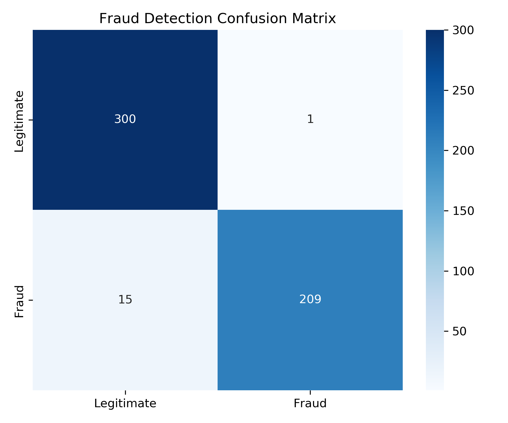
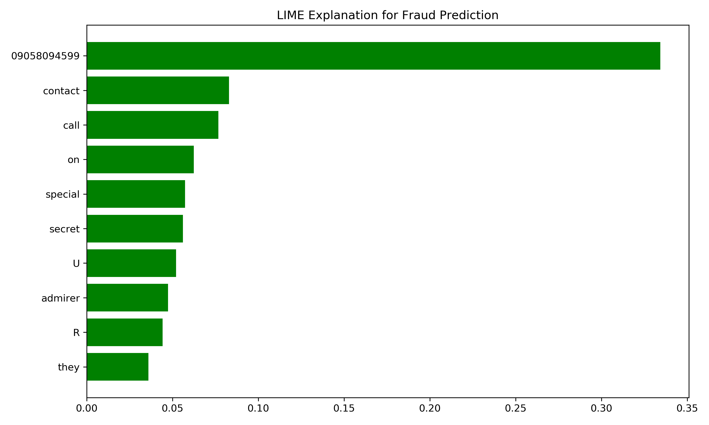

# 📊 SMS Fraud Detection using LLM Embeddings

## 🧠 Project Overview
This project implements a complete end-to-end pipeline for detecting SMS spam using LLM-based embeddings (Mistral), interpretable machine learning, and risk-aware reporting.

It includes:
- Exploratory Data Analysis (EDA)
- Embedding generation using `ollama` Mistral model
- Random Forest classifier with performance evaluation
- LIME explanations for interpretability
- Executive-level HTML/PDF reporting using LLM-generated narrative

---

## 🗂️ Repository Structure

```
├── data/
│   ├── spam.csv                 # Raw dataset (Kaggle UCI SMS Spam)
│   ├── model_metrics.csv        # Saved model evaluation metrics
├── plots/
│   ├── *.png                    # Visuals from EDA, LIME, Confusion Matrix
├── reports/
│   ├── fraud_detection_report.html
│   ├── fraud_detection_report.pdf
├── notebooks/
│   ├── 1_EDA_and_Text_Features.ipynb
│   ├── 2_Mistral_Embeddings_Classifier.ipynb
│   ├── 3_Fraud_Detection_Report_Enhanced.ipynb
├── README.md                   # Project documentation
```

---

## 📥 Installation

1. Clone the repository:
   ```bash
   git clone https://github.com/your-username/your-repo-name.git
   cd your-repo-name
   ```

2. Create environment and install dependencies:
   ```bash
   conda create -n sms-fraud python=3.10 -y
   conda activate sms-fraud
   pip install -r requirements.txt
   ```

3. Install additional system dependencies:
   - **WeasyPrint** requires [GTK3 runtime for Windows](https://github.com/tschoonj/GTK-for-Windows-Runtime-Environment-Installer/releases)
   - Add `C:\Program Files\GTK3-Runtime Win64\bin` to your system PATH

4. Start Jupyter in VS Code or run:
   ```bash
   jupyter notebook
   ```

---

## ⚙️ Notebooks

### 1. EDA + Feature Engineering
- Loads and visualizes data
- Generates word clouds and top spam unigrams

### 2. Model Training with Mistral
- Generates 4096-D embeddings using `ollama`'s Mistral
- Trains a balanced Random Forest
- Saves metrics and plots

### 3. Executive Reporting
- Feeds metrics and text features to LLM for narrative
- Renders HTML/PDF executive report with visuals

---

## 📈 Example Outputs

- Confusion Matrix
  
- LIME Explanation
  

---

## 📄 License
MIT License

---

## 🙋‍♂️ Author
**Your Name** – [your.email@example.com](mailto:your.email@example.com)  
[GitHub](https://github.com/your-username)

---

## ⭐ Star this repo
If you find this project helpful, feel free to give it a ⭐ on [GitHub](https://github.com/your-username/your-repo-name)!